# The Running Team

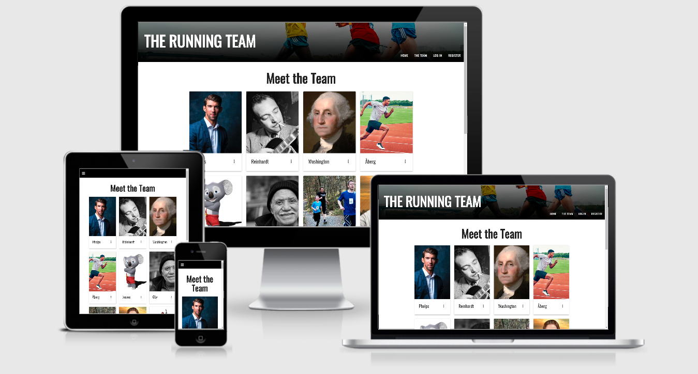
[Live website](https://the-running-team.herokuapp.com)

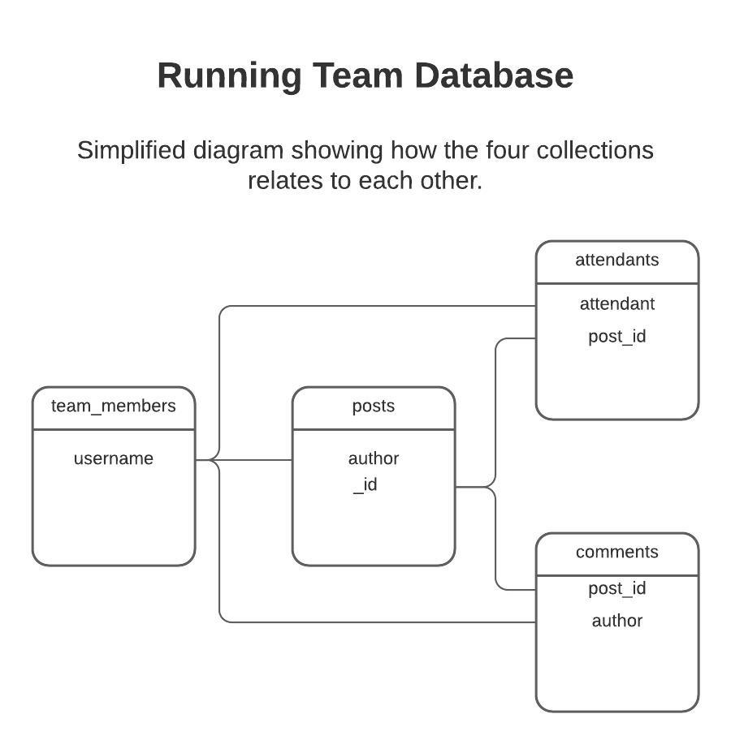
The Running Team is the digital home of a fictional running team. The website is meant to be a place where the team members can plan workouts, share knowledge through blog posts, and keep up to date with the events the team is participating in. However, the website can also be accessed by anyone who's not a member of the team, although in a very restricted view.

 
## UX

### General

The owner of the website(read: the team) recognizes the need for an online gathering point for the team. The website needs to enable the team members to plan out their workouts, share information via blog posts and keep up to date on events. While the owner first and foremost have self interest in the app, it's also important that it offers the general public access to keep updated on the team, while preserving key features of the site for the team members themselves.  

### Typography

The website uses two fonts from [Google Fonts'](https://fonts.google.com/) library called [Oswald](https://fonts.google.com/specimen/Oswald?query=oswald) and [Roboto](https://fonts.google.com/specimen/Roboto?query=roboto)

Oswald is used for all header type elements, while Roboto is used for paragraph type elements and large blocks of text. These fonts, especially Oswald, was chosen with two sources of inspiration: [Runner's World](https://www.runnersworld.com)

and the "Love Running" mini project at Code Institute. Roboto was chosen as it is pleasant to look at and easy to read. This is especially important in the "training blog" section of the website where the user is potentially exposed to large blocks of text. Roboto is also a popular pairing with Oswald and suggested by google fonts.

*Note: Runner's world frequently changes header fonts on their website, and the similarities may not be evident.*

### Colors

In general, the website is minimalistic in use of colors. Black and blue are the main colors used through out the site, where black is dominant. Shades of blue are used for most interactive items like buttons and links. A shade of yellow is used as a "danger" color and displayed when the user tries to delete content.

Although the main frame of the site is conservative in use of color, a more colorful palette is used for the progression bars of each runner. This is evident if the user opens one or more of the cards of each team member. These colors were carefully selected to match up with the level of progression.

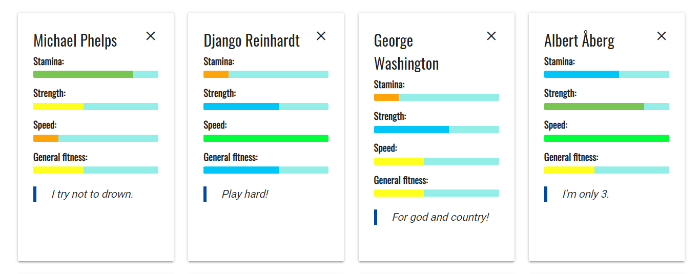

For the most part, text is black on white background. In some cases, where the text is less important, it has a color of light grey. This makes for a sharp contrast and makes it easy to read large blocks of text.  

It is also worth mentioning that the background image in the navigation bar section provides some color as well.
 

### User Stories

- I want to see a navigation bar at the top of the site. The navigation should either follow the page down as I scroll (sticky) or provide some other way to quickly access the navigation bar, independently on how far down the page I currently am.

- Upon entering the website I can immediately see what events I can visit to see the team in action.

- As a non-member of the team, I want to be able to get information about the members of the team.

- As a member of the team, I want to be able to add content to the website in the form of blog posts and workouts.

- As a member of the team I want to be able to edit and delete content that I have added. I also want to be able to remove myself as a member of the team.

- I want to be able to navigate to a section that displays my personal profile, and displays content that I've added to the site.

- At the bottom of the site I want to see a footer containing links to relevant social media sites.

### Wireframes

The wireframes somewhat deviates from the finished website as some of the ideas and features came into existence after the planning process. Note that there is only wireframes for large and small screens. This is due to the simple structure of the website. There is only one breakpoint, so any screen under large (991px) will display the website in single columns.   

- [Learn and explore section](https://github.com/thorole/encryptinator/tree/master/wireframes/learn_forms_sections.pdf) | [Learn section mobile](https://github.com/thorole/encryptinator/tree/master/wireframes/small_screen.pdf)
- [Explore section mobile](https://github.com/thorole/encryptinator/tree/master/wireframes/explore_mobile.pdf)
- [Game](https://github.com/thorole/encryptinator/tree/master/wireframes/game.pdf) | [mobile](wireframes/game_small_screen.pdf)
- [Learn section expanded and modal](https://github.com/thorole/encryptinator/tree/master/wireframes/dropdown_expanded.pdf)

## Features and views

The website has three main views. One view for users who are not logged in, one for when the user's logged in, and one for logged in users with administrator rights.   

### Nav bar
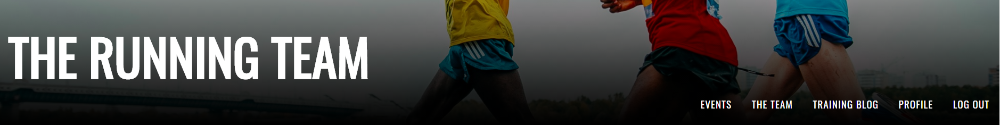

The nav bar comes from Materialize's library and collapses to a "hamburger" on smaller screens. In addition, the navbar is wrapped inside an element containing the background image. Each nav link changes color on hover. 

### Events view (entry point)

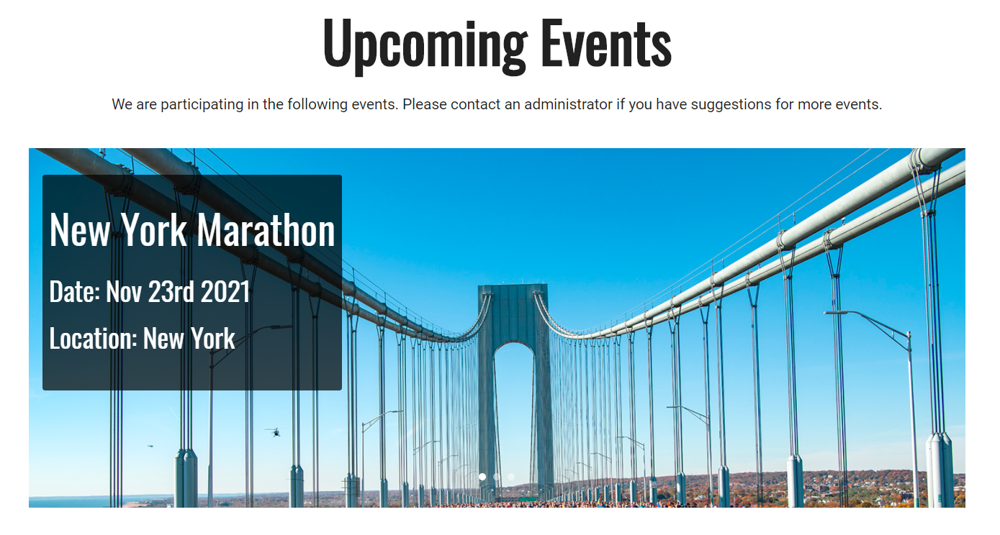

This is the entry point for the website. All events the team will be participating in is displayed in a materialize carousel. This view is accessible for all users, but only logged in users with administrator rights can add, edit and delete events. The subheader text changes depending if there's a logged in user or not.

### The Team view

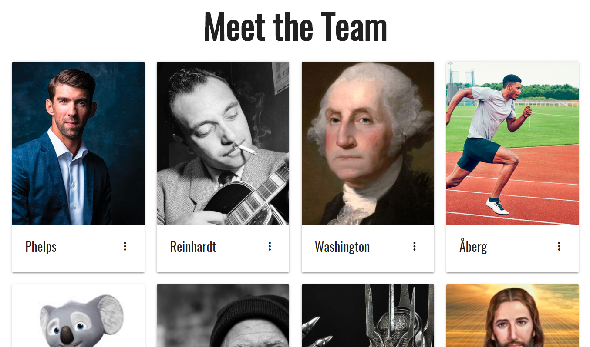

The team section is accessible for all users. All registered users (team members) are displayed in clickable materialize cards. When clicked, the cards display the team member's full name and stats in the for of progression bars.

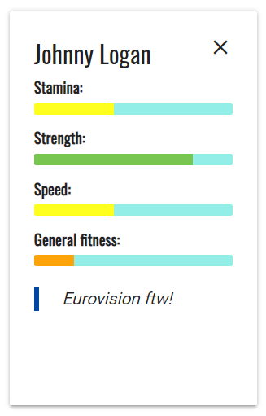

If the user has a slogan, that will be displayed as well.

### Training Blog view
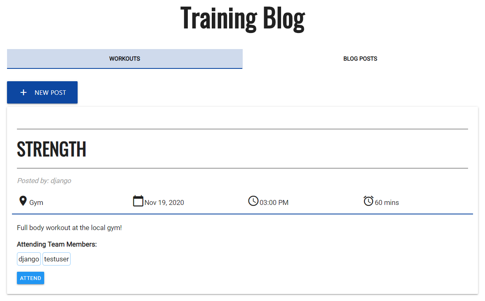

This section is restricted to logged in users. Here, the user can add new workouts and blog posts as well as edit and delete posts that belongs to the current user. Each post is displayed on a simple materialize card. If the user wants to add a post, the form pops up in a modal.

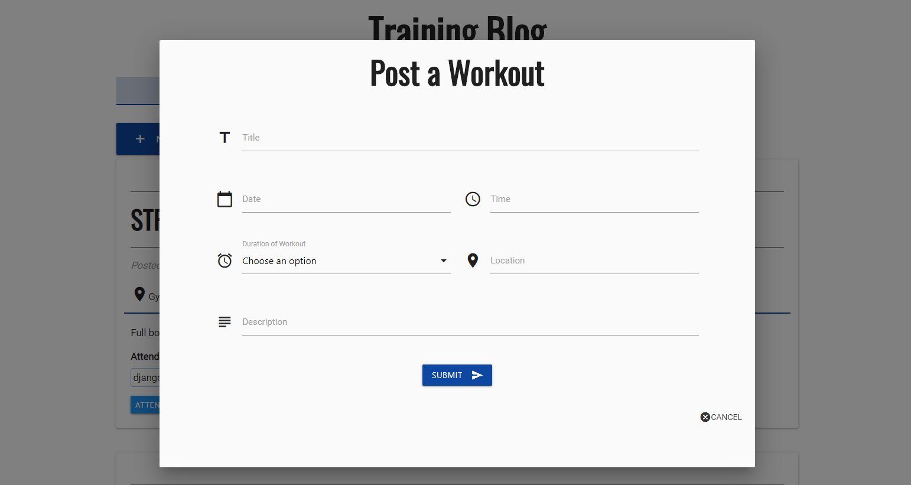

The user can use the tabs to filter workouts and blog posts.

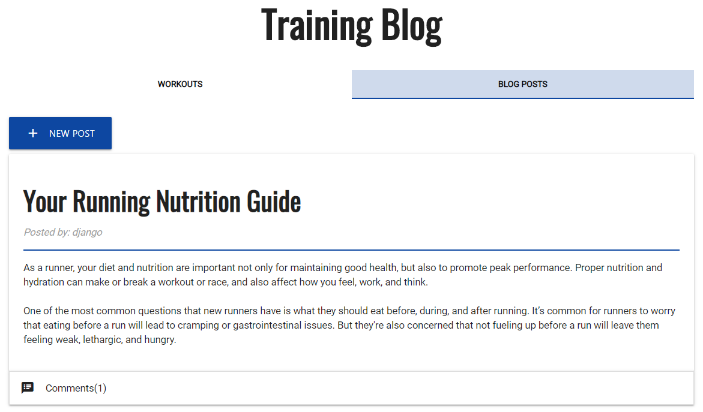

Both workout posts and blog posts has some additional features, where the users can interact with the posts. All workout posts has an "attend/unattend" button to let other users know that they are attending/not attending the particular workout. All attending users are displayed in a section just beneath the body of the post. All of the blog posts can be commented. All comments, including the input field is displayed in a materialize collapsible beneath each post.

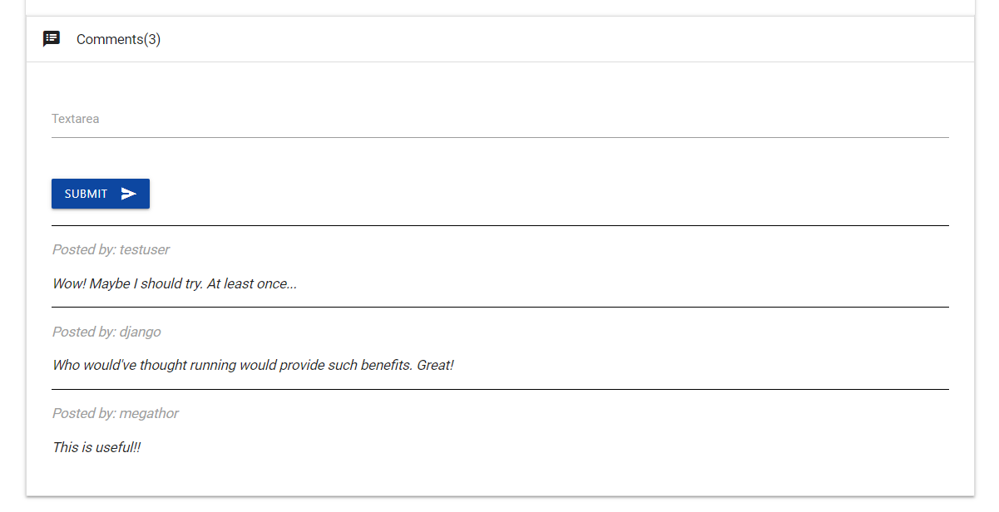

### Profile view

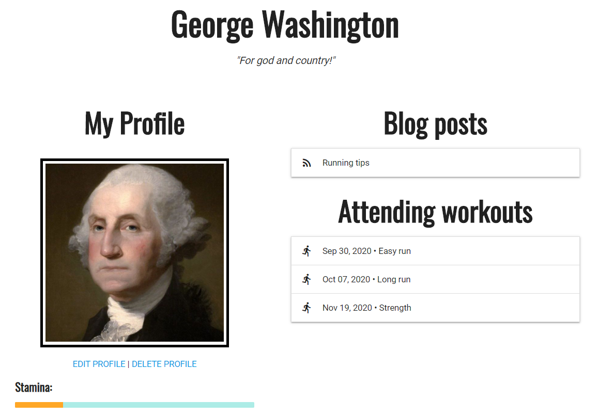

In the profile section, the user can edit and even delete their account. The profile image can be edited without editing the entire account by clicking on it. In addition, all the user's workout- and blog posts are displayed in collapsibles. All the workouts the user is attending are also displayed in collapsibles. This way, the profile page works like a dashboard for the user, containing all information relevant to them.

### Register view

This section is simply a form for the user to fill in and submit. If all required fields are valid, a new record is inserted into mongoDB, the user is redirected to their profile page, and can start using the website.

### Log in/out

This simply allows user to log in and out of the site. Logging in redirects the user to their profile while logging out redirects to The Team section.

### Features Left to Implement

All of the features that was planned for on this website was executed. However, there are almost an endless array of features that can be implemented to make the site even more functional. Here are a few ideas of features that would improve the site (in loosely prioritized order):

- Using AJAX for posting comments and attend/unattend functionality.
- Pagination in the training blog section
- File upload for profile image
- Administrator dashboard
- E-mail confirmation when registering
- Back-end validation of forms 

## Technologies Used

- [Flask](https://flask.palletsprojects.com/en/1.1.x/)
- [Jinja](https://jinja.palletsprojects.com/en/2.11.x/)
- [VS Code](https://code.visualstudio.com/)
- [HTML5](https://www.w3.org/) 
- [CSS3](https://www.w3.org/)
- [Python](https://www.python.org/)
- [Pip](https://pip.pypa.io/en/stable/)
- [mongoDB](https://www.mongodb.com/)
- [JavaScript](https://www.javascript.com/)
- [jQuery](https://jquery.com/)
- [Materialize](https://materializecss.com)
- [Google Fonts](https://fonts.google.com/)
- [Git](https://git-scm.com/)
- [Github](https://www.github.com)
- [Heroku](https://id.heroku.com/)
- [WSL | Ubuntu](https://ubuntu.com/wsl)

## Testing

The testing of the website, both in development and as a finished product has been done through manual testing. As the manual test documentation became very long, it can be viewed in [this document](https://github.com/thorole/encryptinator/blob/master/TESTING.md).

### Notes on defensive design

Since this website relies heavilly on the user for adding content, some measures has been implemented to prevent misuse. The most important feature is registering/login functionality. Even though this project does not focus on user authentication, this feature was added to the project to prevent random users to add, edit or even delete documents in the database.

In addition to authentication, back-end functions prevents users to brute-force deleting (via url field in browser) content that does not belong to them.

Other than that, all forms uses `required`, `max/min-length` and `pattern` attributes where relevant.

It's worth mentioning that regex for url inputs (like profile image) is somewhat strict, and users may experience that some urls does not fulfill the rquirements, even though it's a valid url. This is why a file upload should replace this feature in future updates of the site.

### Bug report

Through out development, there has been a series of minor and more complex bugs. The most important tool for debuggin has been printing information in the cli while the app is running. 

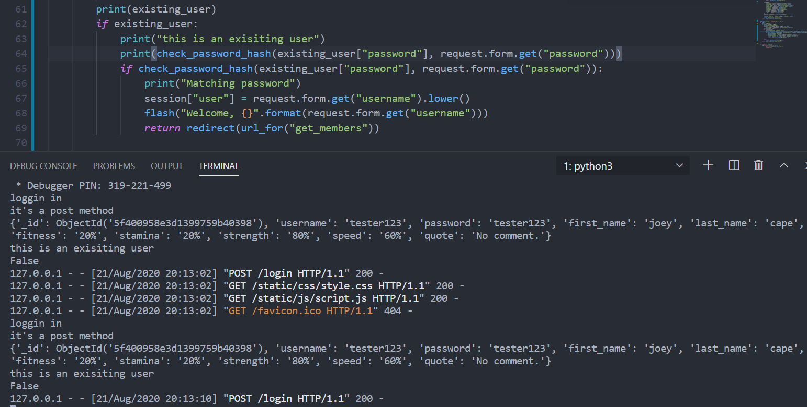

Debugging login

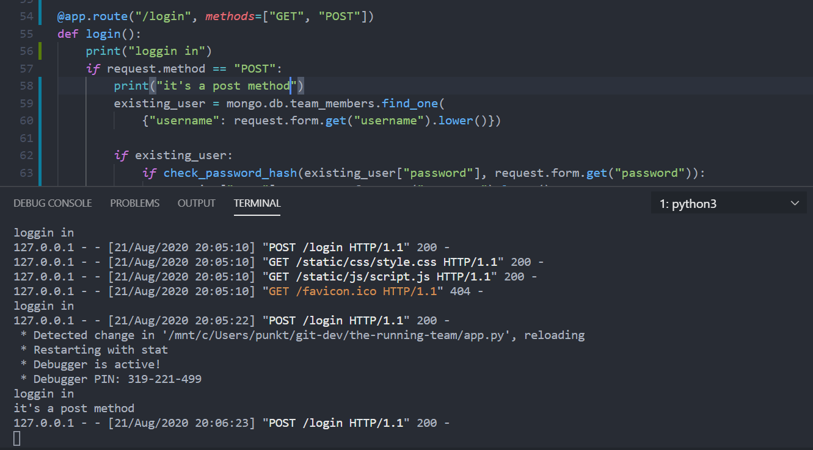

The console was used to debug javascript. This image displays debugging of the function that sets the colors and widths of the progression bars.

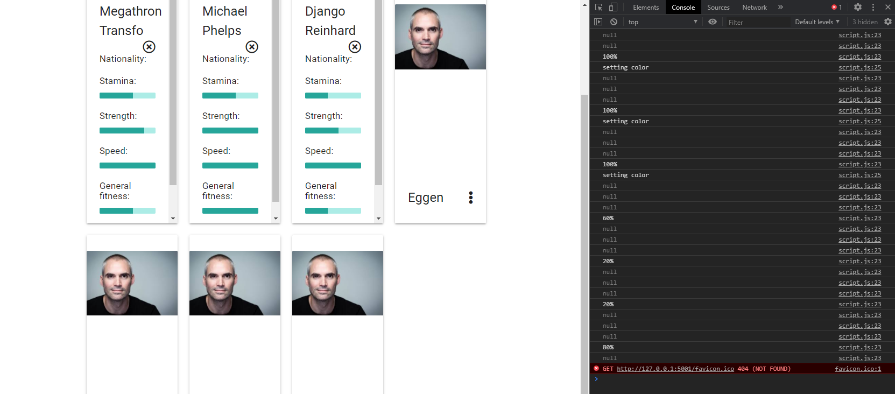

Other than this, printing variables directly on the templates using jinja has also been a method of debugging.

There is currently one known bug in the app. This bug is related to users who view the site on ios devices. All select inputs are more or less non-functional. When touching the select, the drop down of options is displayed, as intended. However, the user will be unable to choose their desired option. Instead, when pressing an option, what seems like a random option is selected. Luckily, just beneath the input, a small downward pointing arrow is visible, which lets the user utilize a standard select instead, which works as it should.

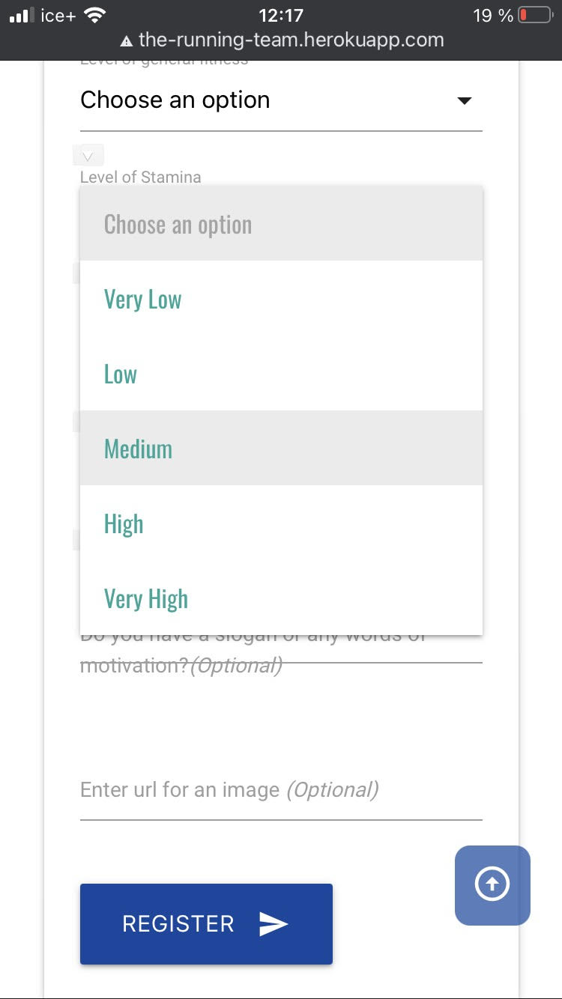

This is a known issue with materialize selects and ios devices. Currently there are no known quick fixes. Some users on github has tried to provide solutions with javascript. Some of these were tried out for the project, but without success.

You can read more about the issue in this github thread:
[ios selects](https://github.com/Dogfalo/materialize/issues/6464)

*Note: this bug only arises on physical ios devices. In chrome dev-tools, when choosing an iphone, the select behaves as intended.*

### Testing and Responsiveness across browsers and devices
The website was built and tested in Chrome throughout the construction. In addition it has been tested
in Mozilla Firefox, MS Edge and Mac OS Safari. The website is responsive as intended across
all browsers used in testing.

The website has also been tested physically on iPhone S, ipad 2nd gen., iPhone 7 and Mi a2 Redmi note 7.
The website responds well to smaller screen sizes and no major problems have appeared, except for the select issue on ios. The site utilizes the materialize grid system and changes column sizing from small and up to x-large screens, depending on the view. For instance, the forms is either single column or two-columns, while "The Team" view has breakpoints for small, medium, large and x-large screens. During construction the site was constantly tested on phone sized
screen in the Chrome dev. tools to make sure it looked good and behaved as intended.

#### Tools used in testing
- [JsHint](https://jshint.com/) (0 warnings)
- [PEP-8 checker](http://pep8online.com/)(All right)
- [W3C Markup Validation](https://validator.w3.org/) (0 errors in html.)
- [W3C CSS Validation](https://jigsaw.w3.org/css-validator/#validate_by_input)(0 errors, 17 warnings of unknown vendor extensions.) 
- [Accessibility checker](https://www.achecker.ca) (Multiple known problems, all related to use of `<i>` for icons. In most cases, swapping with `` solves the problem, but this does not translate well with materialize.)
- [Autoprefixer](https://autoprefixer.github.io/)
- [Chrome DevTools](https://developers.google.com/web/tools/chrome-devtools)

## Deployment

**This procedure was followed to deploy Encryptinator**

1. Navigate to the [repository](https://github.com/thorole/encryptinator)
2. Select [Branch: master]
3. Go to settings
4. Scroll down to "Github Pages". Make sure the repo is set to public in "Danger Zone"-section beneath. 
5. Select [master branch] 
6. Refresh setting page and scroll down to "Github pages" to view the live website URL.

**To clone the repository, follow these instructions:**

1. Navigate to the [repository](https://github.com/thorole/encryptinator)
2. Click **Clone or download**
3. Copy the url from the **Clone or download** dropdown.
4. In cli, navigate to the folder where you want to clone the repository.
5. Type *git clone*, and then paste the URL you copied in Step 3.
6. Press Enter 

For more information, visit [Cloning a repository](https://help.github.com/en/github/creating-cloning-and-archiving-repositories/cloning-a-repository)
on github.

## Credits

### Content
The figure image in the cesar cipher learn section was taken from [Wikipedia](https://no.wikipedia.org/wiki/C%C3%A6sarchiffer). Most of the facts in the learn section was also taken from the same Wikipedia page.

### Acknowledgements

This template heavilly inspired the website and was used as a _visual reference_ to create a command line themed website. None of the actual code behind the template was used.
https://brobin.github.io/hacker-bootstrap/

Thanks to my mentor [Jonathan Munz](https://github.com/jpmunz) for guidance on the project and for providing online litterature.

This site was used to double check that the encryption/decryption forms was working correctly in development.
https://cryptii.com/pipes/vigenere-cipher

